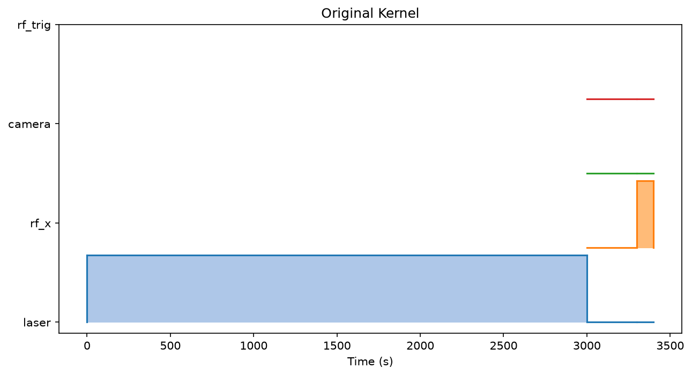
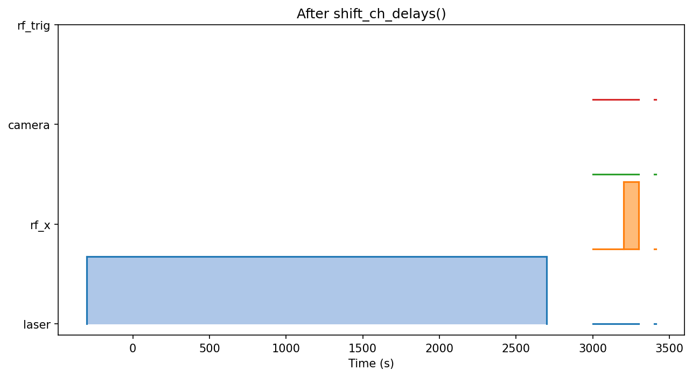
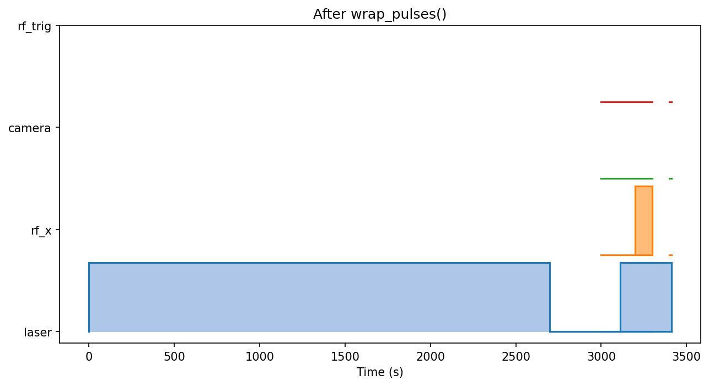
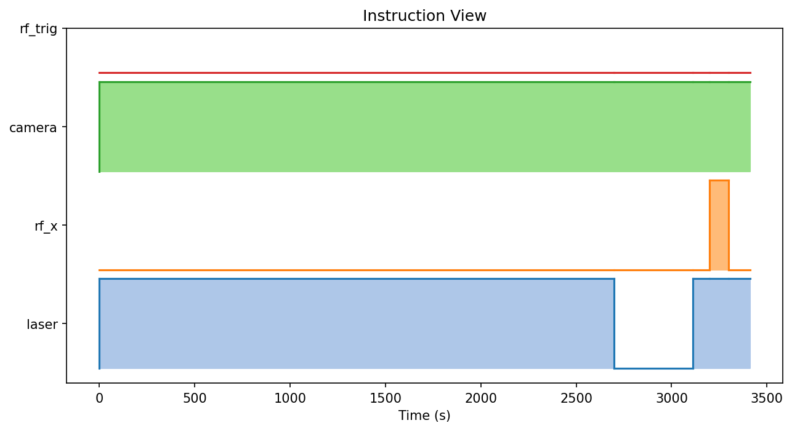

SeqGen
======

SeqGen is a lightweight framework to define abstract pulse kernels and convert them into device-specific instruction sequences. It helps you build reusable kernels and assemble larger, more complex sequences, while keeping hardware adapters pluggable (e.g., SpinCore PulseBlaster).

Key concepts
- PulseKernel: channel-oriented kernel with pulses, delays, optional variable durations.
- Instructions: derived from kernels, a flat list of active channels + durations, plus optional constant channels.
- Adapters: device-specific modules that translate instructions to hardware commands.

Install
```
pip install -e .
pip install -e plugins
```

Quick start
```python
from seqgen import PulseKernel

ch_defs = {
    "laser": "00000001",
    "rf_x": "00000010",
    "camera": "01000000",
}

pk = PulseKernel(ch_defs)
pk.add_pulse(["laser"], 0, 1_000, ch_delay=300)  # ns
pk.append_delay(200)
pk.append_pulse(["rf_x"], 12, var_dur=True)
pk.finish_kernel()

pk.update_var_durs(200)     # update variable durations
pk.convert_to_instructions(const_chs=["camera"])  # device-agnostic
```

Plotting
```python
pk.plot_pulses()
pk.plot_inst_kernel()
```

Adapters
- See `seqgen/pulseblaster` for an example SpinCore PulseBlaster adapter.

Design notes
- Times are in integer nanoseconds.
- `finish_kernel()` snapshots the initial kernel; `update_var_durs()` recomputes shifts.
- `convert_to_instructions()` merges adjacent identical states to minimize instructions.

**Pulsed ESR Example**
- Build and visualize a pulsed ESR kernel through its transformation steps.
- Generate figures with:
```
python examples/plot_p_esr_sequence.py
```
- Resulting plots (saved under `examples/img/`):
    - Original kernel (delays in place)
        
    - After `shift_ch_delays()` (per-channel delays shift pulses earlier)
        
    - After `wrap_pulses()` (negative-start segments wrap to end)
        
    - Instruction view (`convert_to_instructions()`), with `camera` held constant
        
